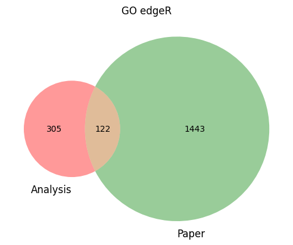
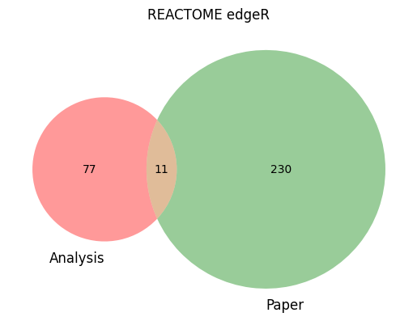

```{r setup, include=FALSE}
library(systemPipeR)
knitr::opts_chunk$set(echo = TRUE)
```

## Data acquisition
Data was collected from Alexander Tyshkovskiy's experiement, Identification and Application of Gene Expression Signatures Associated with Lifespan Extension (<https://pubmed.ncbi.nlm.nih.gov/31353263/>). The corresponding GEO Accession is GSE131901.
Paired end data were downloaded through fastq-dump. A batch script was interated through a .txt file containing the download paths.
```
module load sratoolkit/3.0.0
fastq-dump --accession $1  --split-files --gzip --outdir /rhome/slokr001/shared/slokray/data/$1
```

## Initialize targets file and param file
Targets file was created in Google Sheets, exported as a .tsv file, and converted to a .txt file
```{r data table}
targets <- read.delim("/rhome/slokr001/shared/slokray/SraRunInfo - pairedTargets.txt", comment.char ="#")
DT::datatable(targets, options = list(scrollX = TRUE, autoWidth = TRUE))
```
Param file
```{r param}
parampath <- "/rhome/slokr001/shared/slokray/param/hisat2PE.param" 
read.delim(parampath, comment.char = "#")
```

## Index *Mus musculus* Genome
GTF and genome fasta files were downloaded from <https://ftp.ensembl.org/pub/release-110/gtf/mus_musculus/Mus_musculus.GRCm39.110.gtf.gz> and <https://ftp.ensembl.org/pub/release-110/fasta/mus_musculus/dna/Mus_musculus.GRCm39.dna.primary_assembly.fa.gz> respectively. The genome was indexed with hisat2-build.
```
hisat2-build ./data/Mus_musculus.GRCm39.dna.primary_assembly.fa ./data/hisat_musculus
```

## Alignment of FASTq file
Sequences were aligned to the *Mus musculus* genome using hisat2. Batch script was used to generate the Sequence Alignment Map (SAM) file which was later converted to a Binary Alignment Map (BAM) file to save storage.
```
# align sequence to genome
hisat2 -p 6 -k 1 --min-intronlen 30 --max-intronlen 3000 \
        -S $HOME_DIR/results/PE/$3 \
        -x $HOME_DIR/data/hisat_musmusculus \
        -1 $HOME_DIR/data/$1 \
        -2 $HOME_DIR/data/$2

# convert SAM to BAM
module load samtools/1.19.2
samtools view -bS $HOME_DIR/SRR9119203_1.fastq.gz.hisat.sam > $HOME_DIR/SRR9119203_1.fastq.gz.hisat.bam
```

## Read counting
```{r read counts}
counts <- read.table("./mousecountDFeByg.xls", row.names = 1, check.names = FALSE)[1:100,]
DT::datatable(counts, options = list(scrollX = TRUE, autoWidth = TRUE))
```

## DEG analysis with edgeR
```
# mouseedgeRcomp.xls was obtained via
mouse_countDF <- read.table("./mouserpkmDFeByg.xls")
mouse_cmp <- readComp(args, format="matrix", delim="-")
mouse_edgeDF <- run_edgeR(countDF=mouse_countDF, targets=targetsin(args), cmp=mouse_cmp[[1]], independent=FALSE, mdsplot="")
write.table(mouse_edgeDF, "./mouseedgeRcomp.xls", quote=FALSE, sep="\t", col.names = NA)
```
```{r edgeDF}
mouse_edgeDF <- read.table("./mouseedgeRcomp.xls", row.names = 1, check.names = FALSE)[1:200,]
DT::datatable(mouse_edgeDF, options = list(scrollX = TRUE, autoWidth = TRUE))
```

## Analysis
Plot Phylogentic Tree
```{r phylogentic, fig.height=10}
library(ape)
fpkmDFeBygpath <- "./mousefpkmDFeByg.xls"  # system.file("extdata", "rpkmDFeByg.xls", package="systemPipeR")
fpkmDFeByg <- read.table(fpkmDFeBygpath, check.names=FALSE)
fpkmDFeByg <- fpkmDFeByg[rowMeans(fpkmDFeByg) > 50,]
d <- cor(fpkmDFeByg, method="spearman")
hc <- hclust(as.dist(1-d))
plot.phylo(as.phylo(hc), type="p", edge.col="blue", edge.width=2, show.node.label=TRUE, no.margin=TRUE)
```

normalized columns pvalue < 0.05
```{r scaled, fig.height=12}
library(poolr)
library(ape)
tableEdgeR <- read.table('./mouseedgeRcomp.xls')
scaledCounts <- read.table('./scale.xls')
pvalColumns <- grep("PVal", colnames(tableEdgeR), value = TRUE)
tablePval <- tableEdgeR[,pvalColumns]
scaledCounts <- scaledCounts[complete.cases(tableEdgeR), ]
tablePval <- na.omit(tablePval)
for (i in 1:nrow(tablePval)) {
  rowPval <- tablePval[i, ]
  rowPval <- c(as.numeric(rowPval))
  fisherPval <- fisher(rowPval)
  tablePval$fisherPval[i] <- as.numeric(fisherPval$p)
}
filteredCounts <- scaledCounts[tablePval$fisherPval < 0.05,]
d <- cor(filteredCounts, method="spearman")
hc <- hclust(as.dist(1-d))
plot.phylo(as.phylo(hc), type="p", edge.col="blue", edge.width=2, show.node.label=TRUE, no.margin=TRUE) 
```

## Significant pathways comparasion (analysis vs. paper)

```{r, echo=FALSE, out.width="70%"}

```

```{r, echo=FALSE, out.width="70%"}

```